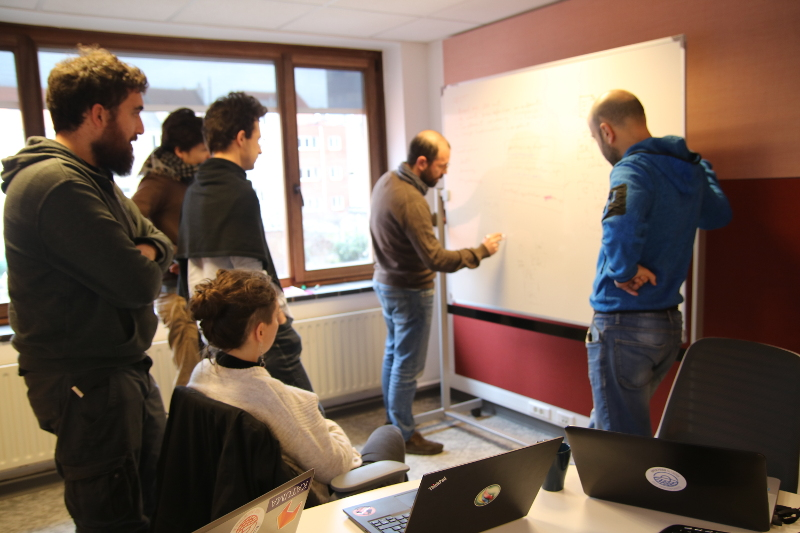

## History

*   Meeting 4 & 5 february 2019 “[ IT & Social Economy Open Space Event](https://gestion.coopiteasy.be/documents)” (Brussels)
*   Meeting 3 & 4 february 2020 “[Coopdevs & CoopITEasy Gathering](https://docs.google.com/document/d/1Vi8uKbxaH-bBhkafSvwnwlZIsfCFl5_Hk8J1R3T25kI/edit)” (Brussels)

## Main actors & Stakeholders

[CoopITEasy](https://coopiteasy.be/en/) & [Coopdevs](https://coopdevs.org/) as  IT workers cooperatives that offer services around Odoo ERP are the main promoters of this intercooperation.

Other cooperatives, federations, second level alliances, etc. are or can be involved. Examples: 

*   [Beescoop](http://bees-coop.be/)
*   [Som Mobilita](https://www.sommobilitat.coop/)t with SOM alliance or with [The Mobility Factory](https://www.themobilityfactory.eu/) 
*   [GRAP](http://www.grap.coop/le-groupement/)
*   [FoodCoopBCN](https://foodcoopbcn.cat/) & other Catalan foodcoops
*   [OFN](https://www.openfoodnetwork.org/)

## What and Why?

We want to:

*   Develop & maintain a common base of Odoo modules
*   Promote Open Source Community around Odoo modules
*   Create documentation & maintain it in order for other cooperatives to come into the intercooperation and benefit from our previous experiences

The main goal of this intercooperation is to share forces to improve Cooperativism movement through IT, specifically with Odoo ERP. We truly believe that the Cooperativism movement can improve our society and take care of our environment.

With Open Source approach we will differentiate from other initiatives and that will give us a competitive advantage : it will be easier for new FoodCoops to use the solution and contribute with new ideas and energy, we will share the workload for the maintenance, etc.

## How?

*   Define common goals, tasks, strategy and time milestones
    *   IT Intercooperation
    *   Common Odoo projects
*   Recurrent meeting (checkpoints, annual meeting, …)
*   Common space available with information about intercooperation
*   Harmonize the way the coops work with Odoo (code, infrastructure)
*   Maintain and promote Open Source Community
    *   Community management
    *   Code
    *   Documentation
    *   Infrastructures
    *   Best practices
*   Invest together: time or money in the intercooperation projects

## Management

We must define what people and what tasks they should perform to coordinate all the tasks and people involved in the intercooperation.

We propose 8h a month for a coordination team (1 from CoopITEasy & 1 from Coopdevs) with the tasks:

*   Organize the checkpoint meetings and the annual meeting
*   Make sure that the tasks are done
*   Investigate funds for intercooperation
*   Ensure common space with documentation and all intercooperation information
*   External communication to the world about our intercooperation

## Roadmap & Highlight Topics for 2020

*   Joint solution for Scale and Point of sale
*   Cooperative Management : 
    *   user workflow improvement
    *   Online payement, SEPA payement (directly instead of by bank transfer)
    *   Technical onboarding for Coopdev to be able to collaborate and make Easy My Coop Spain-compatible
    *   API for registration of new members
    *   Vertical-Cooperative for other user cases
*   Open Source Community around Odoo modules
*   Deployment and technical shared competencies
*   Documentation : 
    *   Shared documentation on Odoo
    *   Setup for a FoodCoop in Odoo
    
## Join us! 

Say hello at [https://community.coopdevs.org/c/it-processes-for-coops](https://community.coopdevs.org/c/it-processes-for-coops)