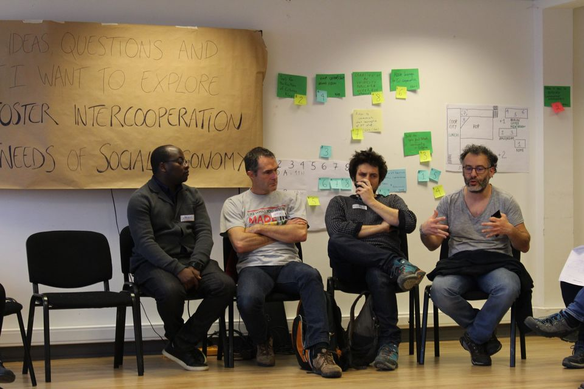
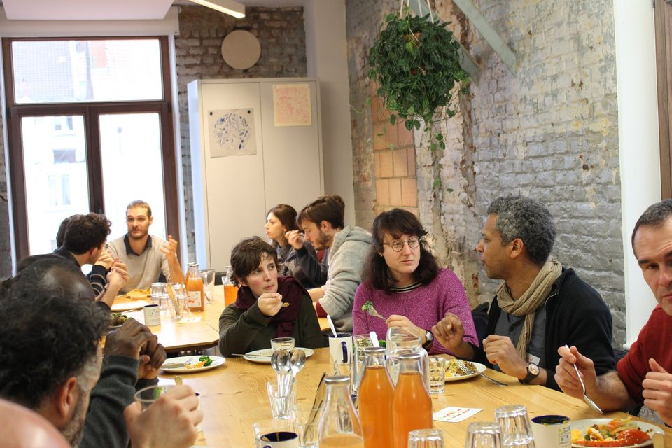

## A network of IT cooperatives

Actors of the Social Economy need IT Tools to realize their missions. From share-management in an energy cooperative over member shift systems in cooperative supermarkets to management tools for shared housing initiatives. Luckily, a variety of IT cooperatives exists that build these tools. 

Inspired by the [ICA principles](https://www.ica.coop/en/cooperatives/cooperative-identity#cooperation-among-cooperatives), we have joined forces as IT cooperatives to **mutualize resources, share knowledge and build better tools together**. With a bigger network we'll also be able to work on some more complex projects. In all these ways, we hope to empower the actors we are supporting, and help make a change towards a more sustainable world.

Come build IT Tools for the Social Economy with us!

## History

This idea for this project began when Barcelona-based [Coopdevs](https://coopdevs.org/) took part in the *IT & Social Economy Open Space Event* organized by Brussels-based [Coop IT Easy](http://coopiteasy.be/) on 4 & 5 February 2019. After learning about the various projects they were working on, the idea grew to share tools among clients and collaborate on each other's projects. This was intensified one year later, at a *Food Hackathon* where developers dove into the code together, and where the principles for an inter-cooperation were drafter.

## Main actors

[Coop IT Easy](https://coopiteasy.be/en/) and [Coopdevs](https://coopdevs.org/) are [workers cooperatives](https://en.wikipedia.org/wiki/Worker_cooperative) that offer IT services for actors in the Social Economy, and mostly work with Odoo ERP. They are currently the main promoters of this intercooperation effort, and are hoping to welcome many other actors.

We've currently established links with a number of organizations:

* [Grap](http://www.grap.coop/) or 'Groupement Régional Alimentaire de Proximité' is a cooperative working around food provisioning in Lyon, and has a dedicated developper team.
* [Le Nid](https://lenid.ch/) is a cooperative supermarket in Geneva, with some voluntary developers.
* [Mycéliandre](https://myceliandre.fr/) in Besançon, France is providing IT support for various projects.
* ... *Your team or project here?*

## Our Goals

* **Develop & maintain a common base of IT Tools** for the main branches of the Social Economy (currently mainly Odoo modules).
* **Maintain documentation** for the tools we build, making it as easy as possible for others to install and use our tools.
* **Promote Open Source tools** and support their community.
* **Improve Cooperativist movement through IT**. We truly believe that the Cooperativism movement can improve our society and take care of our environment.

## In practice

We defined a strategy, set **goals and tasks** and distributed the work - ranging from improving our tools to facilitating the intercooperation. We **meet once a month** to discuss the progress made. Each member dedicates time to **work on the intercooperation projects**.

In the future we hope to have a common budget for bigger tasks, and explore mutualization of costs between the various actors and ourselves.

## Main projects

<b>Cooperative Share Management</b> through <a href="https://github.com/coopiteasy/vertical-cooperative">Easy My Coop</a>

<b>Cooperative Supermarket Management</b> through <a href="https://github.com/beescoop/Obeesdoo">Obeesdoo</a>

 
Obeesdoo was initially developed for the [BEEScoop](https://bees-coop.be/) supermarket.

We are considering to add other tools we've been building, in the areas such as short circuit distribution logistics and website sale, cooperative housing, ...

## Road map & Highlight Topics for 2020

* Set up an intercooperation group: strategy, website, documentation system, ...
* Move towards a joint solution for Scale and Point of Sale
* Improve our Cooperative Share Management tool *Easy My Coop*: 
    * Improve the user work-flow
    * Improve Online payment and SEPA payment (directly instead of by bank transfer)
    * Implement an API for registration of new members
    * Make it Spain-compatible
    
## Join us! 

Thinking about joining our group? Have a question?

Write us an [email](mailto:info@coopiteasy.be) or say hello on the [Coopdev's forum](https://community.coopdevs.org/c/it-processes-for-coops)

And of course, don't hesitate to directly ask questions through an Issue or submit improvement through Pull Requests!

  

    
  

  

    
  

  

    
  

  

    
  

